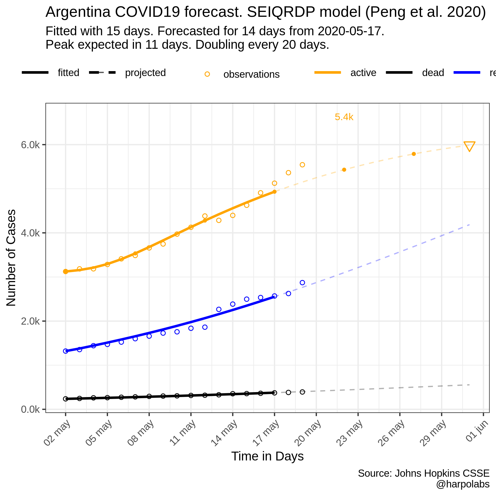
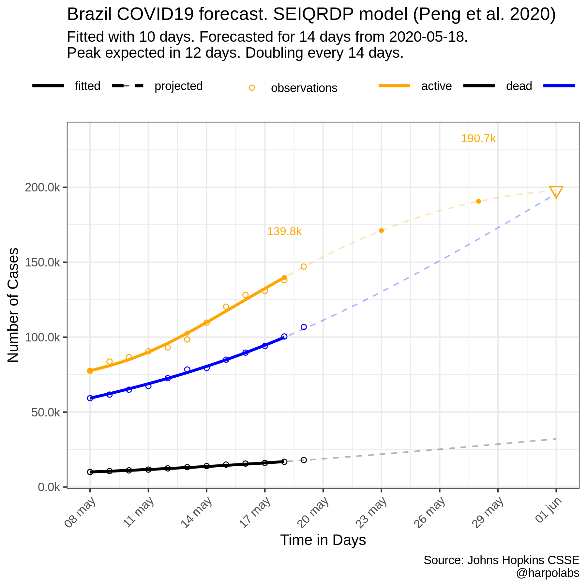
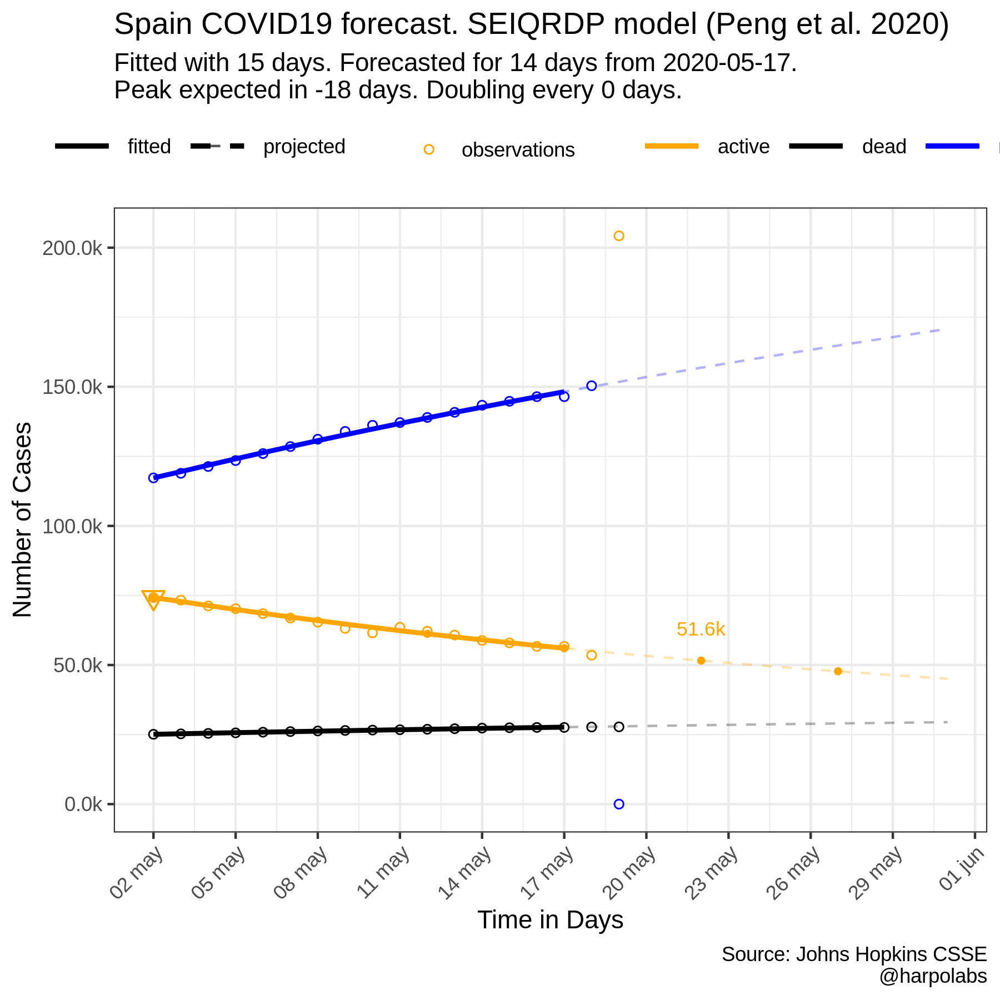
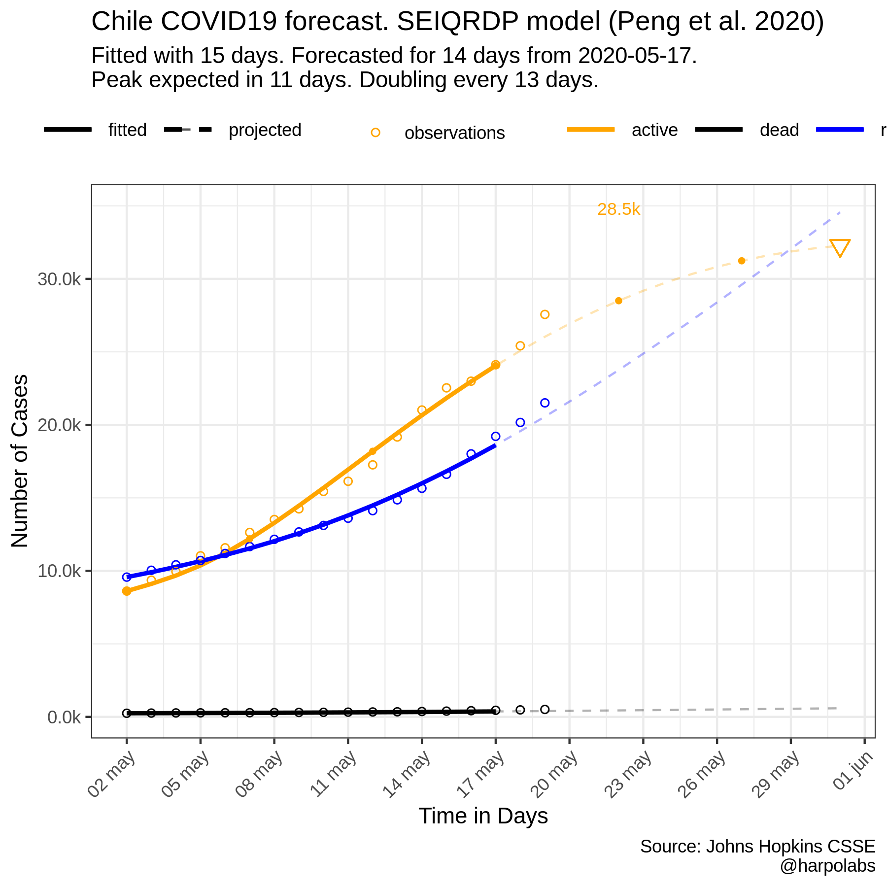
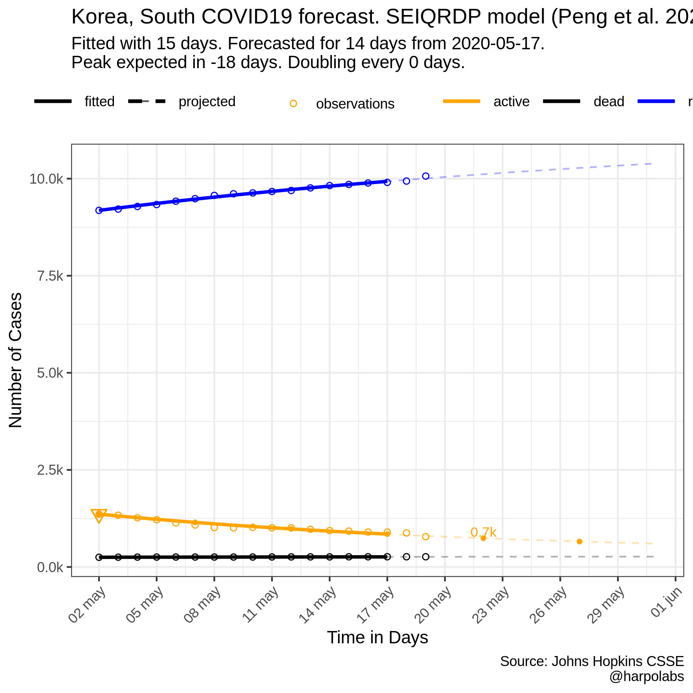

Yet Another COVID19 Projection
================

Projection for the next 15 days in several countries using a SEIRQRDP model based on [Peng et al. 2020](https://arxiv.org/pdf/2002.06563.pdf). R Code adapted (barely) from matlab [E. Cheynet's code](https://la.mathworks.com/matlabcentral/fileexchange/74545-generalized-seir-epidemic-model-fitting-and-computation)

Source code at [github]()

**DISCLAIMER** Dot not consider these projections seriously. I'm far from being an expert on this field. They were made just for testing and fun.

Argentina
=========

``` r
LT <- 5    #1-14 days, latent time in days, incubation period, gamma^(-1)   
QT <- 14  #Quarantine time in days, recovery time, infectious period, delta^(-1)
alpha_guess <- 1.0
beta_guess <- 1.0
gamma_guess <- 1 / LT
delta_guess <- 1 / QT
kappa_guess <- 0.01 #dead rate
lambda_guess <- 0.5 # recover rate
region = "Argentina"
population =  40e6

data<-get_jhu_data(region=region,population = population )
data_fit<-create_fit_data(data,fitted_date = fitted_date,start_date = start_date)
parameters<-c(alpha_guess,beta_guess,gamma_guess,delta_guess,kappa_guess,lambda_guess)
params<-SEIQRDP_fit(parameters,data_fit)
forecast <-15
forecast_data <- SEIQRDP_predict(forecast,params,data_fit,data)
plot<-SEIQRDP_plot(forecast_data,region)

ggsave(filename = paste("images/SEIQRDP_",region,".png",sep=""),height = 6,width = 6,plot = plot)
```



Brazil
======

``` r
region="Brazil"
population=21e7

start_date<-(today()-12) 
fitted_date<-(start_date+10) 
start_date <- start_date %>% format('%m-%d-%Y')
fitted_date <- fitted_date %>% format('%m-%d-%Y')


data<-get_jhu_data(region=region,population = population )
data_fit<-create_fit_data(data,fitted_date = fitted_date,start_date = start_date)
parameters<-c(alpha_guess,beta_guess,gamma_guess,delta_guess,kappa_guess,lambda_guess)
params<-SEIQRDP_fit(parameters,data_fit)
forecast <-15
forecast_data <- SEIQRDP_predict(forecast,params,data_fit,data)
plot<-SEIQRDP_plot(forecast_data,region)
ggsave(filename = paste("images/SEIQRDP_",region,".png",sep=""),height = 6,width = 6,plot = plot)
```

 \# Italy

``` r
start_date<-(today()-18) 
fitted_date<-(start_date+15) 
start_date <- start_date %>% format('%m-%d-%Y')
fitted_date <- fitted_date %>% format('%m-%d-%Y')

region ="Italy"
population=61e6
data<-get_jhu_data(region=region,population = population )
data_fit<-create_fit_data(data,fitted_date = fitted_date,start_date = start_date)
parameters<-c(alpha_guess,beta_guess,gamma_guess,delta_guess,kappa_guess,lambda_guess)
params<-SEIQRDP_fit(parameters,data_fit)
forecast <-15
forecast_data <- SEIQRDP_predict(forecast,params,data_fit,data)
plot<-SEIQRDP_plot(forecast_data,region)

ggsave(filename = paste("images/SEIQRDP_",region,".png",sep=""),height = 6,width = 6,plot = plot)
```


Spain
=====

``` r
region = "Spain"
population = 46e6

data<-get_jhu_data(region=region,population = population )
data_fit<-create_fit_data(data,fitted_date = fitted_date,start_date = start_date)
parameters<-c(alpha_guess,beta_guess,gamma_guess,delta_guess,kappa_guess,lambda_guess)
params<-SEIQRDP_fit(parameters,data_fit)
forecast <-15
forecast_data <- SEIQRDP_predict(forecast,params,data_fit,data)
plot<-SEIQRDP_plot(forecast_data,region)

ggsave(filename = paste("images/SEIQRDP_",region,".png",sep=""),height = 6,width = 6,plot = plot)
```



Chile
=====

``` r
region ="Chile"
population=18e6
data<-get_jhu_data(region=region,population = population )
data_fit<-create_fit_data(data,fitted_date = fitted_date,start_date = start_date)
parameters<-c(alpha_guess,beta_guess,gamma_guess,delta_guess,kappa_guess,lambda_guess)
params<-SEIQRDP_fit(parameters,data_fit)
forecast <-15
forecast_data <- SEIQRDP_predict(forecast,params,data_fit,data)
plot<-SEIQRDP_plot(forecast_data,region)

ggsave(filename = paste("images/SEIQRDP_",region,".png",sep=""),height = 6,width = 6,plot = plot)
```



Korea
=====

``` r
region ="Korea, South"
population=60e6
data<-get_jhu_data(region=region,population = population )
data_fit<-create_fit_data(data,fitted_date = fitted_date,start_date = start_date)
parameters<-c(alpha_guess,beta_guess,gamma_guess,delta_guess,kappa_guess,lambda_guess)
params<-SEIQRDP_fit(parameters,data_fit)
forecast <-15
forecast_data <- SEIQRDP_predict(forecast,params,data_fit,data)
plot<-SEIQRDP_plot(forecast_data,region)
ggsave(filename = paste("images/SEIQRDP_Korea.png",sep=""),height = 6,width = 6,plot = plot)

calculate_double_time(forecast_data)
```

    ## [1] 0


