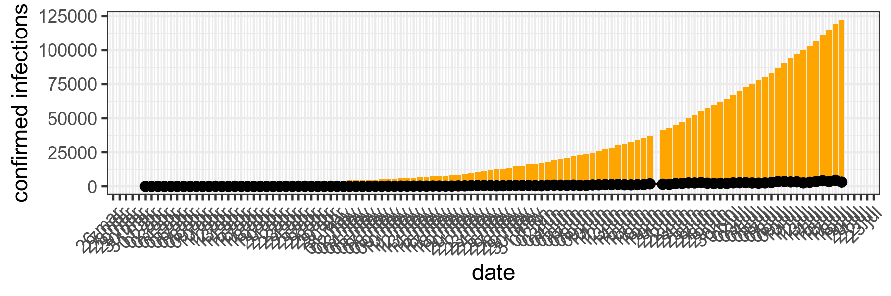
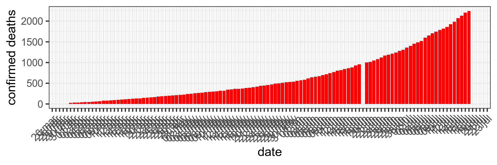
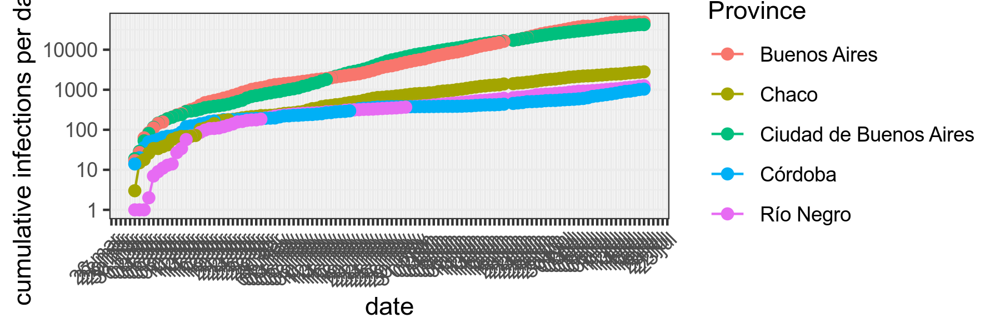
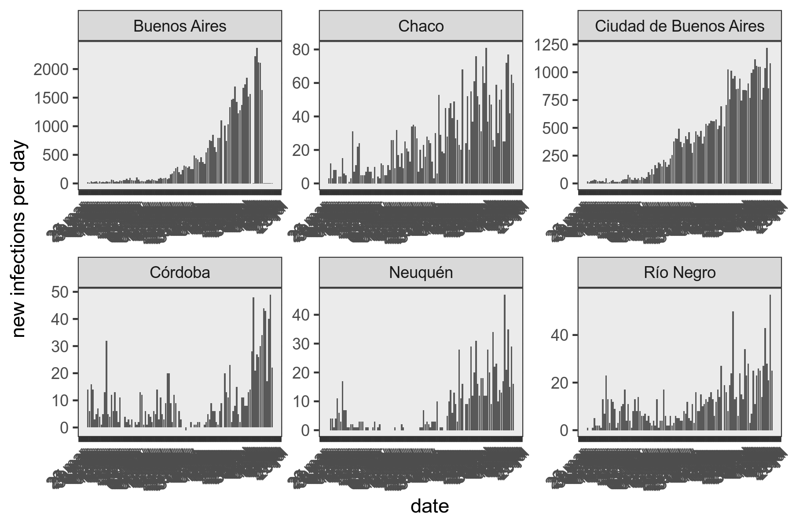

```{r setup, include=FALSE}
knitr::opts_chunk$set(echo = TRUE)
```

```{r echo=FALSE, message=FALSE, warning=FALSE}
setwd("/home/harpo/Dropbox/ongoing-work/git-repos/COVID19/dataset/")
suppressMessages(library(ggplot2))
suppressMessages(library(dplyr))
suppressMessages(library(readr))
suppressMessages(library(lubridate))
library(tidyr)
library(tibble)
covid19_arg<-read_delim("COVID19_ARG.tsv",delim ='\t')
```

# The dataset
The dataset was produced using *only* the official information provided by the Argentine Ministry of Health. 
[*available here*](https://www.argentina.gob.ar/coronavirus/informe-diario)

The dataset contains daily information from mars 5th, when the first case was reported. A total of 33 variables are included. All the variables contain daily information with the exceptin of the those starting with `total_`, which refers to cumulative values.

```{r}
names(covid19_arg)[1:33]
```


# Example

## Just load the dataset first
```{r message=FALSE, warning=FALSE}
covid19_arg<-read_delim("COVID19_ARG.tsv",delim ='\t')
```


# Simple plots using `tidyverse`

## Total and daily number of confirmed infections 


```{r pressure, message=FALSE, warning=FALSE}
covid19_arg<-covid19_arg %>% mutate(date=mdy(date))
covid19_arg %>% ggplot()+
  geom_col(aes(x=date,y=total_cases),fill='orange')+
  geom_line(aes(x=date,y=new_cases),fill='green')+
  geom_point(aes(x=date,y=new_cases),fill='green',size=2)+
    ylab("confirmed infections")+
  theme_bw()+
    scale_x_date(date_breaks = "1 day", date_labels = "%d %b")+
  theme(axis.text.x = element_text(angle = 45, hjust = 1))+
  ggsave("images/total.png",height = 2,width = 6)
```



## Total and daily number of confirmed deaths

```{r message=FALSE, warning=FALSE}
covid19_arg %>% ggplot()+
  geom_col(aes(x=date,y=total_deaths),fill='red')+
  geom_line(aes(x=date,y=new_deaths),fill='green')+
  geom_point(aes(x=date,y=new_deaths),fill='green',size=2)+
    ylab("confirmed deaths")+
  scale_x_date(date_breaks = "1 day", date_labels = "%d %b")+
  theme_bw()+
  theme(axis.text.x = element_text(angle = 45, hjust = 1))+
  ggsave("images/totaldeaths.png",height = 2,width =6)
```


## Total number of deaths per province

```{r message=FALSE, warning=FALSE}

covid19_arg[,c(12:33)] %>% replace(is.na(.), 0) %>% tibble::add_column(date=covid19_arg$date) %>%
  pivot_longer(-date,names_to = "Province", values_to = "total") %>% group_by(Province) %>% summarise(total_cases=sum(total)) %>% arrange((total_cases)) %>%
   ggplot()+
  geom_col(aes(x=Province,y=total_cases),fill='orange')+
    ylab("confirmed infections")+
  #scale_x_date(date_breaks = "1 day", date_labels = "%d %b")+
  theme_bw()+
  theme(axis.text.x = element_text(angle = 45, hjust = 1))+
  ggsave("images/deathsperprovinces.png",height = 2,width =6)
```


## Top 6 provinces with confirmed cases 

```{r message=FALSE, warning=FALSE}

top_5<-covid19_arg[,c(12:33)] %>% replace(is.na(.), 0) %>% tibble::add_column(date=covid19_arg$date) %>%
  pivot_longer(-date,names_to = "Province", values_to = "total") %>% group_by(Province) %>% summarise(total_cases=sum(total)) %>%  top_n(5) %>% select(Province)

covid19_arg[,c(12:33)] %>% replace(is.na(.), 0) %>% tibble::add_column(date=covid19_arg$date) %>%group_by(date) %>%
  pivot_longer(-date,names_to = "Province", values_to = "new_cases") %>% group_by(Province) %>% mutate(cumulative_cases=cumsum(new_cases)) %>% arrange(desc(cumulative_cases)) %>% filter( Province %in% unlist(as.list(top_5))) %>% 

  ggplot()+
  geom_line(aes(x=date,y=cumulative_cases,color=Province))+
  geom_point(aes(x=date,y=cumulative_cases,color=Province),size=2)+
  #geom_line(aes(x=date,y=total))+
  ylab("cumulative infections per day [log]")+
   scale_x_date(date_breaks = "1 day", date_labels = "%d %b")+
  theme_bw()+
  scale_y_continuous(trans='log10')+
  theme(axis.text.x = element_text(angle = 45, hjust = 1))+
  ggsave("images/cumulativeperprovincestop5.png",height = 2,width =6)


```




## Infections per day in Top 6 provinces with confirmed cases 

```{r message=FALSE, warning=FALSE}

top_5<-covid19_arg[,c(12:33)] %>% replace(is.na(.), 0) %>% tibble::add_column(date=covid19_arg$date) %>%
  pivot_longer(-date,names_to = "Province", values_to = "total") %>% group_by(Province) %>% summarise(total_cases=sum(total)) %>%  top_n(6) %>% select(Province)

covid19_arg[,c(12:33)] %>% replace(is.na(.), 0) %>% tibble::add_column(date=covid19_arg$date) %>%
  pivot_longer(-date,names_to = "Province", values_to = "total") %>% filter( Province %in% unlist(as.list(top_5))) %>% 
ggplot()+
  geom_col(aes(x=date,y=total))+
  #geom_point(aes(x=date,y=total,color=Province),size=2)+
  #geom_line(aes(x=date,y=total))+
  ylab("new infections per day")+
   scale_x_date(date_breaks = "1 day", date_labels = "%d %b")+
  theme_bw()+
  theme(axis.text.x = element_text(angle = 45, hjust = 1))+
  facet_wrap(~Province, ncol = 3)+
  ggsave("images/totalprovinces.png",height = 4,width =6)
```



## Simple SIR model for ARG Forcasting for next 5 days

Model adapted from [Tim Churches's](https://timchurches.github.io/blog/posts/2020-02-18-analysing-covid-19-2019-ncov-outbreak-data-with-r-part-1) blog.


